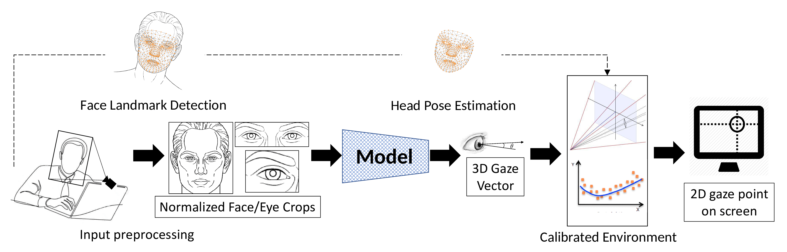
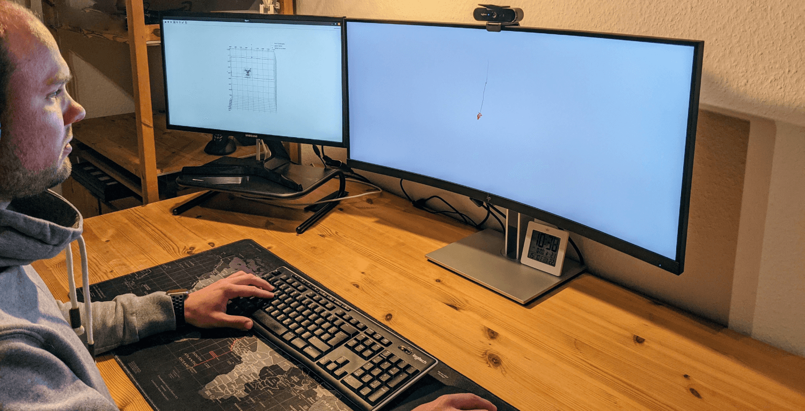

# Framework for the Complete Gaze Tracking Pipeline

The figure below shows a general representation of the camera-to-screen gaze tracking pipeline [1].
The webcam image is preprocessed to create a normalized image of the eyes and face, from left to right. These images are fed into a model, which predicts the 3D gaze vector.
The predicted gaze vector can be projected onto the screen once the user’s head pose is known. \
This framework allows for the implementation of a real-time approach to predict the viewing position on the screen based only on the input image.

1. `pip install -r requirements.txt`
2. If necessary, calibrate the camera using the provided interactive script `python calibrate_camera.py`, see [Camera Calibration by OpenCV](https://docs.opencv.org/4.5.3/dc/dbb/tutorial_py_calibration.html).
3. For higher accuracy, it is also advisable to calibrate the position of the screen as described by [Takahashiet al.](https://doi.org/10.2197/ipsjtcva.8.11), which provide an [OpenCV and matlab implementation](https://github.com/computer-vision/takahashi2012cvpr).
4. To make reliable predictions, the proposed model needs to be specially calibration for each user. A software is provided to [collect this calibration data](https://github.com/pperle/gaze-data-collection).
5. [Train a model](https://github.com/pperle/gaze-tracking) or [download a pretrained model](https://drive.google.com/drive/folders/1-_bOyMgAQmnwRGfQ4QIQk7hrin0Mexch?usp=sharing).
6. If all previous steps are fulfilled, `python main.py --calibration_matrix_path=./calibration_matrix.yaml --model_path=./p00.ckpt` can be executed and a "red laser pointer" should be visible on the screen. `main.py` also provides multiple visualization options like:
   1. `--visualize_preprocessing` to visualize the preprocessed images
   2. `--visualize_laser_pointer` to show the gaze point the person is looking at on the screen like a red laserpointer dot, see the right monitor on the image below
   3. `--visualize_3d` to visualize the head, the screen, and the gaze vector in a 3D scene, see left monitor on the image below

[1] Amogh Gudi, Xin Li, and Jan van Gemert, “Efficiency in real-time webcam gaze tracking”, in Computer Vision - ECCV 2020 Workshops - Glasgow, UK, August 23-28, 2020, Proceedings, Part I, Adrien Bartoli and Andrea Fusiello, Eds., ser. Lecture Notes in Computer Science, vol. 12535, Springer, 2020, pp. 529–543. DOI : 10.1007/978-3-030-66415-2_34. [Online]. Available: https://doi.org/10.1007/978-3-030-66415-2_34.
